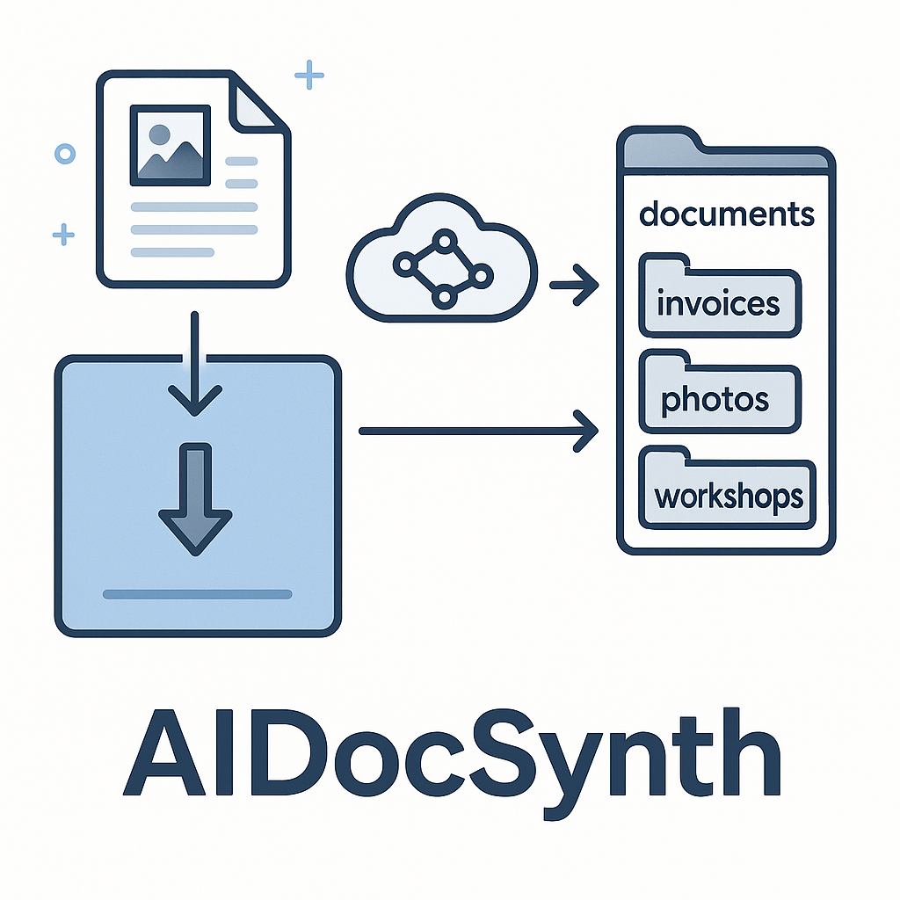

# AIDocSynth

> **Intelligente Dokumenten‑Assistentin für Ordnung ohne Aufwand**
> *Automatisiert – Plattform‑unabhängig – Open Source*



---

## Warum AIDocSynth?

Sammeln sich bei dir PDF‑Rechnungen, gescannte Belege oder Office‑Dateien an?
AIDocSynth liest diese Dokumente, **versteht** ihren Inhalt dank KI und *sortiert, benennt und versieht sie mit Metadaten* – alles auf Knopfdruck oder per Drag‑&‑Drop.

* **Zeit sparen:** Keine manuelle Ablage mehr.
* **Alles wiederfinden:** Konsistente Dateinamen & folder‑Struktur.
* **Lokale Kontrolle:** Läuft komplett auf deinem Rechner – sensibel bleibt privat.
* **Offen & erweiterbar:** Python‑Code, MIT‑Lizenz, Community‑Add‑ons willkommen!

> *„Ich schiebe nur noch die PDFs aufs Icon – Sekunden später ist alles sortiert.“* – *Beta‑Tester*

---

## Kern‑Features

| Für alle                                                | Für Entwickler                                             |
| ------------------------------------------------------- | ---------------------------------------------------------- |
| 🖱️ Einfaches **Drag‑&‑Drop** in die App                | Modularer **Pipeline‑Aufbau** (Services, Provider, UI)     |
| 🔎 **OCR** erkennt Text selbst in Scans                 | **LLM‑Abstraktionsschicht** (OpenAI, Azure, Ollama u.v.m.) |
| 🤖 **KI‑Klassifizierung** wählt Zielordner & Dateiname  | **Pydantic‑Modelle** für strikte Datenvalidierung          |
| 🏷️ **Metadaten** werden ins Dokument zurückgeschrieben | **pytest**‑Test‑Suite & Smoke‑Tests                        |
| 📂 Automatische **Backups** & Versions‑Handling         | **PyInstaller**‑Spec für 1‑Klick‑Builds                    |

---

## Schnellstart (für Nicht‑Techniker)

```bash
# 1. Download:  Release‑ZIP oder Installer aus dem GitHub‑Reiter »Releases«
# 2. Entpacken / Installieren  →  AIDocSynth starten
# 3. PDF‑ oder Bild‑Dateien auf das Fenster ziehen … fertig! ✨
```

*Keine Python‑Kenntnisse nötig.*
Für Offline‑KI empfiehlt sich ein lokaler **Ollama‑Server** (optional) – die App funktioniert aber auch ohne.

### Lokale KI mit Ollama nutzen

1. **Ollama installieren**  
   • macOS: `brew install ollama`  
   • Windows / Linux: Installer von [ollama.com](https://ollama.com)

2. **Server starten** – einfach `ollama serve` ausführen.  
   Die Standard-Adresse `http://localhost:11434` wird von AIDocSynth automatisch erkannt.

3. **Modell herunterladen** (einmalig):
   ```bash
   ollama pull mistral-small3.1
   ```
   Wir empfehlen *mistral-small 3.1* (ca. 15 GB) – schnell, sparsam und präzise.

4. **In AIDocSynth auswählen**:  
   Menü **Einstellungen → LLM-Provider** öffnen, »Ollama« wählen und als *Model Name* `mistral-small3.1` eingeben.

5. **macOS & Windows Sicherheitshinweis**  
   Bei der ersten Ausführung blockieren Gatekeeper (macOS) bzw. SmartScreen (Windows) eventuell die Anwendung.
   * **macOS:** Rechtsklick → *Öffnen* oder in **Systemeinstellungen → Datenschutz & Sicherheit** die App »Dennoch öffnen«.  
     Apple-Anleitung: <https://support.apple.com/de-de/guide/mac-help/mh40616/mac>  
   * **Windows:** Warnung ignorieren und *Trotzdem ausführen* wählen.  
     Schritt-für-Schritt: <https://www.pctipp.ch/praxis/windows/windows-programm-trotzdem-ausfuehren-2006472.html>

> Beim ersten Lauf wird das Modell heruntergeladen; danach arbeitet AIDocSynth komplett offline.

---

## Entwickler‑Setup

```bash
# Klonen
git clone https://github.com/tobit0101/AIDocSynth.git && cd AIDocSynth

# Virtuelle Umgebung
python -m venv .venv && source .venv/bin/activate  # Windows: .venv\Scripts\activate

# Abhängigkeiten
pip install -r requirements.txt

# Dev‑Start (Hot‑Reload via `pytest -q`)
python -m aidocsynth.app
```

### Ordnerstruktur (Kurz‑Überblick)

```text
AIDocSynth/
├─ aidocsynth/           # Hauptpaket
│  ├─ controllers/       # MVC‑Controller (UI‑Logik, Pipeline)
│  ├─ models/            # Pydantic‑ & Dataclasses
│  ├─ services/          # Funktionale Bausteine (OCR, LLM, File‑Ops …)
│  ├─ ui/                # Qt‑Designer .ui oder Python‑Views
│  └─ app.py             # Entry‑Point (Qt‑Application)
├─ tests/                # pytest Smoke‑ & Unit‑Tests
└─ build/                # PyInstaller‑Spec & Ressourcen
```

---

## Architektur‑Überblick

1. **DropArea → MainController** — nimmt Pfade entgegen, legt `Job` an.
2. **Worker Thread** führt asynchrone **Pipeline** aus: Backup → Text‑Extraktion (direkt + OCR) → LLM‑Klassifizierung → Sortierung.
3. **Provider‑Layer** abstrahiert OpenAI, Azure OpenAI, Ollama etc.
4. **JobTableModel** aktualisiert UI in Echtzeit (Qt signals).

---

## Roadmap

* [x] **MVP** mit OpenAI‑Workflow & Basis‑GUI
* [ ] Job History mit Aktiv/Abgeschlossen Prozessen
* [ ] Wizard für Ersteinrichtung (API‑Keys, Ordnerwahl)
* [ ] Automatische Überwachung eines »Eingang«‑Ordners
* [ ] Mehrsprachige UI (i18n)
* [ ] Plug‑in‑System für Custom‑Prompts & Metadaten‑Schemas

Du hast Ideen? → **Issues** eröffnen oder **Pull Request** schicken!

---

## Contributing

1. Fork das Repo und erstelle einen Branch (`feature/xyz`).
2. Halte dich an [Conventional Commits](https://www.conventionalcommits.org/) & Projekt‑Linting.
3. Führe `pytest` aus – alle Tests müssen grün sein.
4. Öffne einen Pull Request – wir freuen uns! 💚

---

## Sicherheit & Privatsphäre

* **On‑Device OCR** (doctr) → keine Cloud‑Uploads nötig.
* **LLM Provider frei wählbar** – verwende lokale Modelle für maximale DSGVO‑Konformität.
* Open Source ⇢ voll einsehbar & auditierbar.

---

## Lizenz

AIDocSynth steht unter der **MIT‑Lizenz**.
Siehe [LICENSE](LICENSE) für Details.

---

## Kontakt & Community

* **Issues / Discussions:** [github.com/tobit0101/AIDocSynth](https://github.com/tobit0101/AIDocSynth)

> *Made with ♥ in Baden‑Württemberg*
